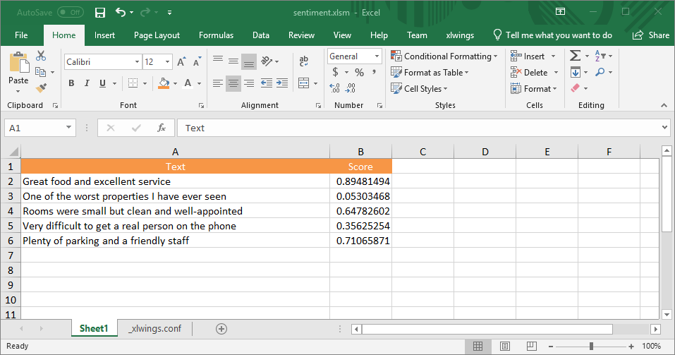

# Introduction

Imagine that you work for a large corporation where [Microsoft Office](https://products.office.com/home) is the lifeblood of productivity. Tools such as [Word](https://products.office.com/word), [Excel](https://products.office.com/excel), and [PowerPoint](https://products.office.com/powerpoint) are staples of daily life, and fluency in these products is a critical skill. You have been tasked with automating some of the processes that revolve around documents created with these products, and Python is the programming language with which you are most familiar.

Most people don't think about Python when they think about Office. But thanks to free, open-source packages such as [Python-docx](https://python-docx.readthedocs.io/en/latest/), [Openpyxl](https://openpyxl.readthedocs.io/en/stable/), and [PyXLL](https://www.pyxll.com/), Python is a powerful tool for managing and manipulating Office documents. Even PDF files are fair game with help from libraries such as [PyPDF4](https://pypi.org/project/PyPDF4/).

Such endeavors are more than academic. With Python, you can query a database, perform calculations on the data, and create a Word document summarizing the results. You can gather data and write it to an Excel spreadsheet — complete with charts — rather than a CSV file. You can even write user-defined functions (UDFs) in Python and call them from Excel. Suppose your goal is to create a spreadsheet that uses machine learning in its calculations. With products such as [Xlwings](https://www.xlwings.org/), popular Python packages such as [Pandas](https://pandas.pydata.org/) and [Scikit-learn](https://scikit-learn.org/stable/) become as much a part of Excel's vocabulary as [Visual Basic for Applications](https://en.wikipedia.org/wiki/Visual_Basic_for_Applications) (VBA) and enable scenarios that simply aren't possible using Excel by itself.

## Excel + Python == Smart Spreadheets

The spreadsheet pictured below is one of several examples that you will build in this module. It analyzes each text string in column A for sentiment and displays a score from 0.0 to 1.0 in column B, where 0.0 is negative and 1.0 is positive. Its intelligence comes from a machine-learning model written in Python and trained with tens of thousands of reviews. And it is just one example of the magic you can work with Office when you have Python lending a helping hand.

_Performing sentiment analysis in Excel_

## Learning objectives

In this module, you will learn:

- How to set up a working Python development environment
- How to read from and write to Microsoft Word documents using Python
- How to read from and write to Microsoft Excel documents using Python
- How to write UDFs in Python and call them from Excel
- How to write Python apps that extract pages from PDFs

First up: set up a Python development environment so you can enter and execute Python code.
