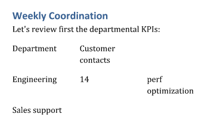

# How to read from and write to a Microsoft Excel document using **OpenPyXL**
 
You're responsible for an enormous, complicated spreadsheet.  You remember that you saw one particular cell in a peculiar color--was it purple?  Blue?  That particular value is suddenly import to you, but how are you going to find it?  Do you have to scan all tens of thousands of individual cells of each of the scores of sheets?

No:  there are easier ways.  In principle, you can use Excel's built-in **Find** dialogue, but it only knows to search for an exact color match.  You could write a macro in VBA, but that presents its own problems.  Let's see how long it takes to solve this in Python ...

## Demonstration program

Install OpenPyXL:

    python -m pip install openpyxl

Create

     from openpyxl import load_workbook
     
     DEFAULT_COLOR = 1
     this_workbook = load_workbook(filename="Total Analysis.xlsx")
     for sheet in this_workbook:
         for column in range(1, 1 + len(list(sheet.columns))):
             for row in range(1, 1 + len(list(sheet.rows))):
                this_cell = sheet.cell(column=column, row=row)
                this_font = this_cell.font
                this_color = this_font.color.value
                if this_color != DEFAULT_COLOR:
                    print(f"On sheet {sheet.title}, cell "
                          f"{this_cell.column}{this_cell.row} "
                          f"has color {this_color}.")

If you have any appropriate `Total Analysis.xlsx` at hand, and you launch this program, you'll immediately see output that looks something like

        ...
    On sheet May 2018, cell J110 has color FF00B0F0.
    On sheet May 2018, cell J111 has color FF00B0F0.
    On sheet May 2018, cell M22 has color FF444444.
    On sheet June 2018, cell A27 has color FFFFFF00.
    On sheet June 2018, cell A32 has color 9.
    On sheet June 2018, cell A33 has color 9.
    On sheet June 2018, cell B8 has color FFFF0000.
    On sheet June 2018, cell B9 has color FFFF0000.
        ...

and so on.  While there is still a little work to do matching these color values to your memory of what you saw, you are close to a answer already.

## One-offs

Notice the peculiar nature of this program.  Generally people think of a computer program as something run many times--maybe thousands or millions of time.  The previous lesson, for instance, focused on an automation that would be useful every couple of weeks.

This small application is different.  It's only designed to be run once, just to help find a one-time result.  That's OK:  some programs are so small and quick to write, that it's faster to let the computer figure out a result for you one time, even including your effort to program the computer, than to undertake any alternative solution.  You can think of this as "experimental" programming.

[TODO:  make point about other tools, include PyXLL]

[TODO:  ...]

Your screen should look something like 

## First success

Python just drafted a Word document for you!  Once written, you can use/edit/update/print/share this document as you would any other Word document--it _is_ like any other Word document.

1.  Now that this little script is working for you, you can modify it to your own situation.  Instead of `my_department.cells[1].text = "14"`, for instance, you might have Python retrieve a value from an external database, and use _that_ in place of `14`.

1.  `python-docx` also knows how to **read** Word documents.  With a little study of [the documentation for **python-docx**](https://python-docx.readthedocs.io/en/latest/), you can write a script to search thousands of Word documents and pick out those which use a specific font, or exceed eighty pages, or so on.

## Summary

...
