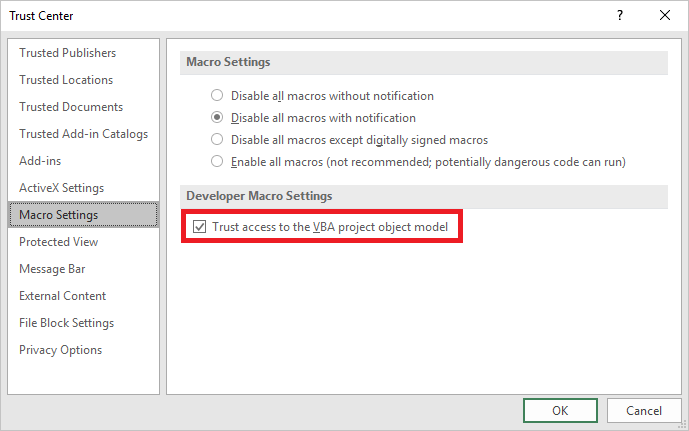
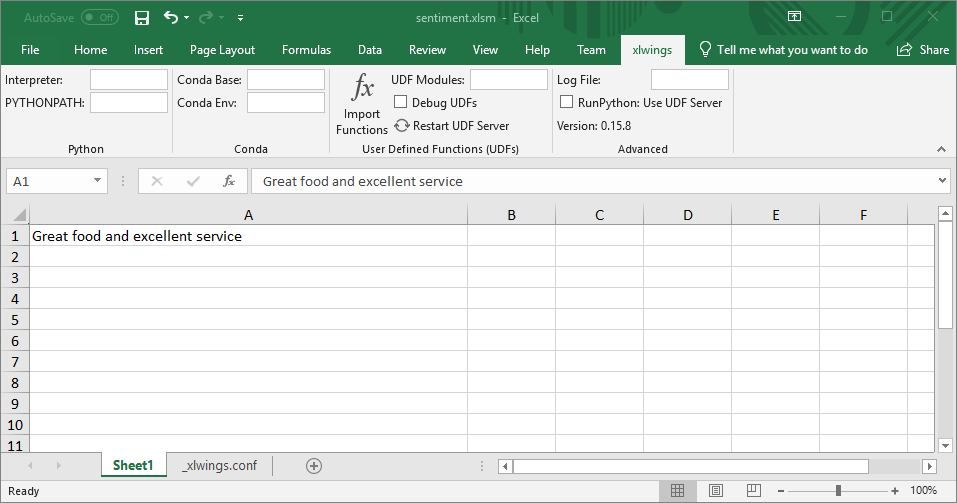
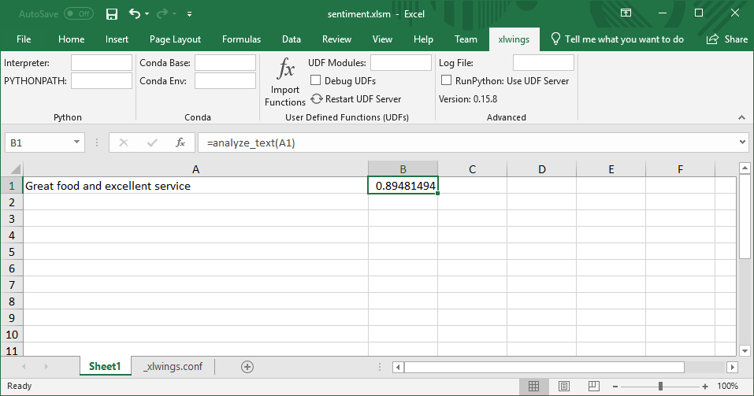

# Use machine learning to perform sentiment analysis in Excel

Imagine that you're a software developer at an Internet vacation-rentals firm and the company's communications department has asked you to create a spreadsheet lets them analyze text for sentiment. The idea is that if sentiment towards the company turns negative on social media, communications can get out in front of it.

Scoring text for sentiment is rather easily accomplished today with machine learning. Python has a number of world-class libraries available for building and training machine-learning models, including [Scikit-learn](https://scikit-learn.org/stable/index.html). Excel supports [User-Defined Functions](https://support.office.com/en-ie/article/create-custom-functions-in-excel-2f06c10b-3622-40d6-a1b2-b6748ae8231f), which enable users to write custom functions that are called just like `SUM()` and `AVG()` and other functions built into Excel. But UDFs are written [Visual Basic for Applications](https://en.wikipedia.org/wiki/Visual_Basic_for_Applications). in order to use Scikit-learn in Excel, you need to be able to write UDFs in Python.

Fortunately, there are libraries that let you do just that. One of them is [Xlwings](https://www.xlwings.org/), an open-source library that combines the power of Excel with the versatility of Python. With it, you can write Python code that loads or creates Excel spreadsheets and manipulates their content, write Python macros triggered by button clicks in Excel, access Excel spreadsheets from Jupyter notebooks, and more. You can also use Xlwings to write UDFs for Excel for Windows.

## Install Xlwings

The first step in building the spreadsheet that Communications wants is configuring Excel to trust VBA add-ins and installing **Xlwings** and and **Scikit-learn**. Let's get these prliminaries out of the way.

1. Open Microsoft Excel and use the **File -> Options** command to open Excel's "Excel Options" dialog. Click **Trust Center** in the menu on the left, and then click the **Trust Center Settings...** button. Click **Macro Settings** on the left, and check the "Trust access to the VBA project object model" box as shown below. Then click **OK** to dismiss the "Trust Center" dialog, followed by **OK** to dismiss the "Excel Options" dialog.

	

	_Configuring Excel to trust VBA add-ins_

1. At a command prompt, use the following command to install **Scikit-learn** and its dependencies:

	```bash
	pip install numpy scipy scikit-learn==0.20.3
	```

	You are installing a specific version of Scikit because your UDF will utilize a saved machine-learning model, and that model was saved with **Scikit-learn** 0.20.3 Generally speaking, a model saved with one version of **Scikit-learn** should be loaded with the same version.

1. Now use the following command to install Xlwings:

	```bash
	pip install xlwings
	```

1. Once the installation is complete, you need to install the Xlwings add-in to Excel:

	```
	xlwings addin install
	```

1. Now `cd` to the directory where you would like to create a UDF and a spreadsheet that uses it and type:

	```bash
	xlwings quickstart sentiment
	```

The `xlwings` command creates a subdirectory named "sentiment" and initializes it with a pair of files: a spreadsheet named **sentiment.xlsm** and a Python file named **sentiment.py**. It is the latter of these in which you will write the UDF that analyzes text for sentiment.

## Write a user-defined function

The next step is write the Python code for the UDF. But first, you need to download a pair of files containing the saved machine-learning model.

1. Download the [zip file containing the saved machine-learning model](https://topcs.blob.core.windows.net/public/office-python-resources.zip) and copy the two files inside it into the "sentiment" subdirectory created by the `xlwings` command in the previous exercise.

	> These two files were generated by training a machine-learning model built with **Scikit-learn** with 50,000 movie reviews available in a public dataset, and then saving the trained model. 

1. Open **sentiment.py** in your favorite text editor and replace its contents with the following Python code:

	```python
	import xlwings as xw
	import pickle, re, os
	from sklearn.feature_extraction.text import CountVectorizer
	
	model_path = os.path.abspath(os.path.join(os.path.dirname(__file__), 'sentiment_analysis.pkl'))
	model = pickle.load(open(model_path, 'rb'))
	
	vocab_path = os.path.abspath(os.path.join(os.path.dirname(__file__), 'vocabulary.pkl'))
	
	vectorizer = CountVectorizer(
	    ngram_range=(1, 2),
	    stop_words=['the', 'and', 'am', 'are'],
	    vocabulary=pickle.load(open(vocab_path, 'rb')))
	
	@xw.func
	def analyze_text(text):
	    text = re.sub("[.;:!\'?,\"()\[\]]", '', text.lower())
	    text = re.sub("(<br\s*/><br\s*/>)|(\-)|(\/)", ' ', text)
	    return model.predict_proba(vectorizer.transform([text]))[0][1]
	```

	This code loads the two **.pkl** files encapsulating the saved machine-learning model into **Scikit-learn** and stores a reference to the model in the variable named `model`. Then it defines a UDF named `analyze_text()` that can be called from Excel. `analyze_text()` "cleans" the text string passed to it by removing punctuation characters and converting it to lowercase, and then vectorizes the text to convert it to numbers. (Machine-learning models deal with numbers, not text, so text must be "vectorized" in this manner before it can be used in machine learning.) Finally, `analyze_text()` passes the vectorized text to the model via **Scikit-learn**'s `predict_proba()` function. That function returns a number from 0.0 to 1.0, with 0.0 representing negative sentiment and 1.0 representing positive sentiment.

1. Save your changes to **sentiment.py**.

The UDF is written. Now it's time to call it from Excel.

## Invoke the UDF from Excel

The elegance of **xlwings** is that once you're written a UDF such as `analyze_text()`, you can call it the same you call functions built into Excel. But first you need to use the **Xlwings** add-in to import the UDFs.

1. Open **sentiment.xlsm** in Excel. Then go to the "xlwings" tab and click **Import Functions** to import the `analyze_text()` function in **sentiment.py**.

	

	_Importing the analyze_text() function_

1. Type "Great food and excellent service" (without quotation marks) into cell A1.

	

	_Entering a string of text to analyze_

1. Type the following expression into cell B1:

	```
	=analyze_text(A1)
	```

	This expression passes the text in cell A1 to the `analyze_text()` function imported from **sentiment.py**.

1. Confirm that a number from 0.0 to 1.0 appears in cell B1. This is the score that the machine-learning model assigned to the text "Great food and excellent service." Remember that 0.0 represents extremely negative sentiment, while 1.0 represents sentiment that is extremely positive. Would you agree with the score?

	

	_Analyzing text for sentiment_

1. Finish up by typing some text strings of your own and seeing how they score for sentiment.

UDFs written in Python open Excel to a new whole new world of possibilities thanks to the rich ecosystem of Python libraries available for machine learning, statistical analysis, and more.