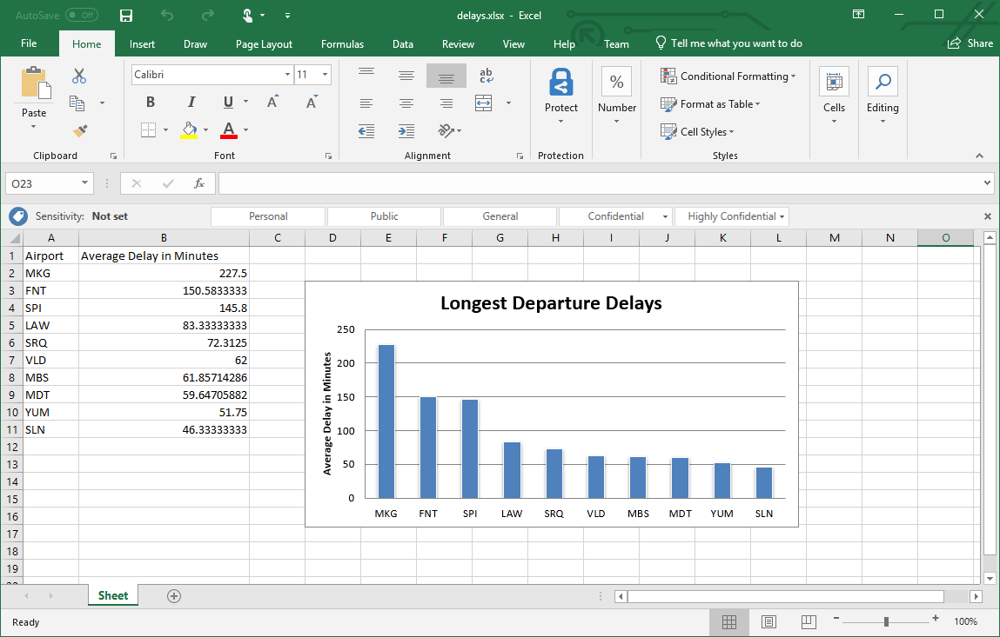

# Analyze data and create an Excel spreadsheet

The program that you wrote to analyze flight delays and produce a Word document summarizing the results went over well and is saving you time each day. But management wants more. They want a spreadsheet to go with the Word document. The spreadsheet should include the airports that incurred the worst average arrival delays. Moreover, it should include a chart depicting those delays.

[Python-docx](https://python-docx.readthedocs.io/en/latest/) saved the day when it came to producing Word documents. [OpenPyXL](https://openpyxl.readthedocs.io/en/stable/) is to Excel as Python-docx is to Word: It lets Python apps create Excel spreadsheets, read Excel spreadsheets, and more. More importantly, it supports virtually all of the features of Excel, including the ability to produce charts and graphs.

Let's build on the previous lesson by using [Pandas](https://pandas.pydata.org/) to analyze flight delays and OpenPyXL to create an XLSX file.

## Analyze data with Pandas

You already know that Pandas is a popular Python library for manipulating and analyzing data. You used it in the previous lesson to load a CSV file containing information about flight delays and extract key metrics from the data. Let's use it again to produce a list of the 10 worst-performing airports.

1. Begin by executing the following commands in a Command Prompt window or terminal to install Pandas and Python-docx:

	```bash
	pip install pandas
	pip install openpyxl
	```

    If you installled Pandas in the previous lesson, you don't have to install it again. But it's important to install OpenPyXL because you will use it in the next exercise.

1. In the previous lesson, you downloaded a small CSV containing information about flight arrivals and departures for a single day. Let's download a much larger one that contains data for an entire month.

    Create a directory to serve as your project directory and `cd` into it. Then use this command to download a CSV file containing the information on flight delays incurred during the previous month:

	```bash
	curl https://topcs.blob.core.windows.net/public/all_flights.csv -o all_flights.csv
	```

	`curl` is a Linux command. It's also installed on Windows 10 build 1706 and higher. If you are running an older version of Windows, you can download `curl` from the [`curl` download page](https://curl.haxx.se/download.html), or you can download the CSV file directly from [here](https://topcs.blob.core.windows.net/public/all_flight.csv).

    > Don't be surprised if the download takes a little while. The CSV file you downloaded in the previous lesson contained just 100 lines. This one contains more than 600,000!

1. Take a moment to browse the contents of **all_flights.csv**. It contains a header row with column names, followed by more than rows containing information on individual flights. The ARR_DELAY column indicates the number of minutes each flight was late in arriving. A negative number means the flight arrived at its destination early.

1. Create a text file named **all_flights.py** and open it in your favorite text editor. Then paste in the following code and save the file:

	```python
	import pandas as pd
	
    # Load the data
	df = pd.read_csv('all_flights.csv')

    # Eliminate duplicate rows
    df = df.drop_duplicates()

    # Identify the 10 worst-performing airports
    mean_by_airport = df.groupby('ORIGIN')['ARR_DELAY'].mean().sort_values(ascending=False).head(10)

    # Print the results
	print(mean_by_airport)
	```

	Like many real-world datasets, **all_flights.csv** isn't ready to be used right out of the gate. It contains hundreds of duplicate rows which would bias the results. Fortunately, a call to Pandas's [drop_duplicates()](https://pandas.pydata.org/pandas-docs/stable/reference/api/pandas.DataFrame.drop_duplicates.html) method on the DataFrame removes the duplicate rows. This is one reason why Pandas is so popular among data scientists.

1. Use the following command to execute **all_delays.py**:

	```bash
	python all_delays.py
	```

1. Confirm that the output looks like this:

	```
    OTH    53.129032
    LAR    44.722222
    PSM    35.700000
    ECP    34.995037
    JLN    30.209677
    SHD    29.311475
    ADK    28.625000
    ASE    28.170290
    UIN    27.925926
    GRI    26.493827
    Name: ARR_DELAY, dtype: float64
	```

As in the previous lesson, the data source is a single CSV file. Recall that Pandas includes methods for loading data from SQL databases and other sources *and* for combining them into a single `DataFrame`, so your code could easily be modified to aggregate data from a variety of data sources.

## Generate an Excel spreadsheet with OpenPyXL

TODO: Add introduction.

1. Open **all_delays.py** and insert the following statements at the top of the file:

	```python
    from openpyxl import Workbook
    from openpyxl.chart import BarChart, Reference
	```

1. Add these statements to the bottom of the file, and then save your changes:

	```python
    # Create a spreadsheet
    workbook = Workbook()
    worksheet = workbook.active
    worksheet.append(['Airport', 'Average Delay in Minutes'])

    for name, val in mean_by_airport.items():
        worksheet.append([name, val])

    worksheet.column_dimensions['B'].width = 28

    chart = BarChart()
    chart.type = "col"
    chart.style = 10
    chart.title = "Worst-Performing Airports"
    data = Reference(worksheet, min_col=2, min_row=1, max_row=11)
    categories = Reference(worksheet, min_col=1, min_row=2, max_row=11)
    chart.add_data(data, titles_from_data=True)
    chart.set_categories(categories)
    chart.y_axis.title = 'Average Delay in Minutes'
    chart.legend = None
    chart.shape = 8
    worksheet.add_chart(chart, "D3")

    workbook.save('delays.xlsx')
	```

    This code begins by creating a `Workbook` object, getting a reference to the active worksheet, and adding rows to the worksheet. The first cell in each row contains an airport code, and the second contains the average arrival delay for flights originating from that airport. It then creates a `BarChart` object and adds it to the worksheet. The `BarChart` object gets it data from the rows and columns added previously.

1. Confirm that the project directory now contains a file named **delays.csv**. Open the file in Microsoft Excel and confirm that it looks like this:

    

OpenPyXL gives you the ability to create spreadsheets on the fly. But what if you wanted to use Python to add whole new capabilities to Excel? What if, for example, you wanted to use machine learning to make predictions from values in a spreadsheet? Funny you should ask, because that is exactly what you will do in the next lesson.