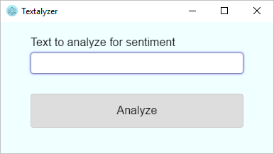

# Call the container from a client app

Now comes the fun part: using REST calls to invoke the machine-learning model running in the container from a client app. In this lesson, you will build the app, and you will use [Node.js](https://nodejs.org/) and [Electron](https://electronjs.org/) as the platform so the app can run on Windows, macOS, and Linux.

1. If Node.js isn't installed on your computer, go to the [Node.js Web site](https://nodejs.org/) and install it it now. You can determine whether Node is installed — and what version is installed — by opening a Command Prompt window or terminal and typing the following command:

	```bash
	node -v
	```

	If Node is installed, the version number will be displayed. If the version number is less than 8.0, **download and install the latest version**.

1. Create a project directory on your hard disk to hold the app.

1. Open the zip file containing the [resources that accompany this module](https://topcs.blob.core.windows.net/public/textalyzer-resources.zip) and copy all of the files inside it to the project directory.

1. `cd` into the project directory at the command prompt. Then execute the following command to download and install the packages that the app requires:

	```bash
	npm install
	```

	The `npm install` command uses the dependencies listed in **project.json** to load the Node.js modules used by the client app.

1. Create a file named **predict.js** in the project directory and paste in the following code:

	```javascript
	$(function () {
	    var url = "http://FQDN:8008/predict";
	
	    // Handle clicks of the Analyze button
	    $("#analyze-button").click(function() {
	        // Get user input
	        var text = $("#input-text").val();
	
	        // Invoke model using REST call
	        $.ajax({
	            type: "GET",
	            url: url + "?text=" + encodeURIComponent(text),
	        }).done(function (data) {
	            showResults(data);
	        }).fail(function(xhr, status, err) {
	            alert(status + " (" + err + ")");
	        });
	    });
	});
	
	function showResults(data) {
	    alert(parseFloat(data).toFixed(4));
	}
	```

	This code registers a click handler for the **Analyze** button defined in **index.html**. The click handler reads the text string that the user typed into an `<input>` field and passes it to the container via an AJAX call. Then it shows what comes back from the call — the sentiment score — in an alert box. 


1. Replace FQDN on line 2 with the container's fully qualified domain name. The modified line should look something like this:

	```javascript
	var url = "http://textalyzer.northcentralus.azurecontainer.io:8008/predict";
	```

1. Return to the command prompt and use the following command to start the client app:

	```bash
	npm start
	```

1. Type a text string into the box and click the **Analyze** button. Wait for an alert box to appear with the results. How positive or negative is the text? Recall that 0.0 represents sentiment that is extremely negative, while 1.0 indicates that the sentiment is extremely positive.

	

	_Analyzing text for sentiment_

1. Try other strings and score them for sentiment, too.

The fact that this is working means you have built and trained a machine-learning model, embedded the model in a Docker container hosted in Azure, and written a cross-platform client app that places REST calls to the container to analyze text for sentiment — and all in about an hour. This is the power of machine learning combined with the ease of use of Azure containers.
