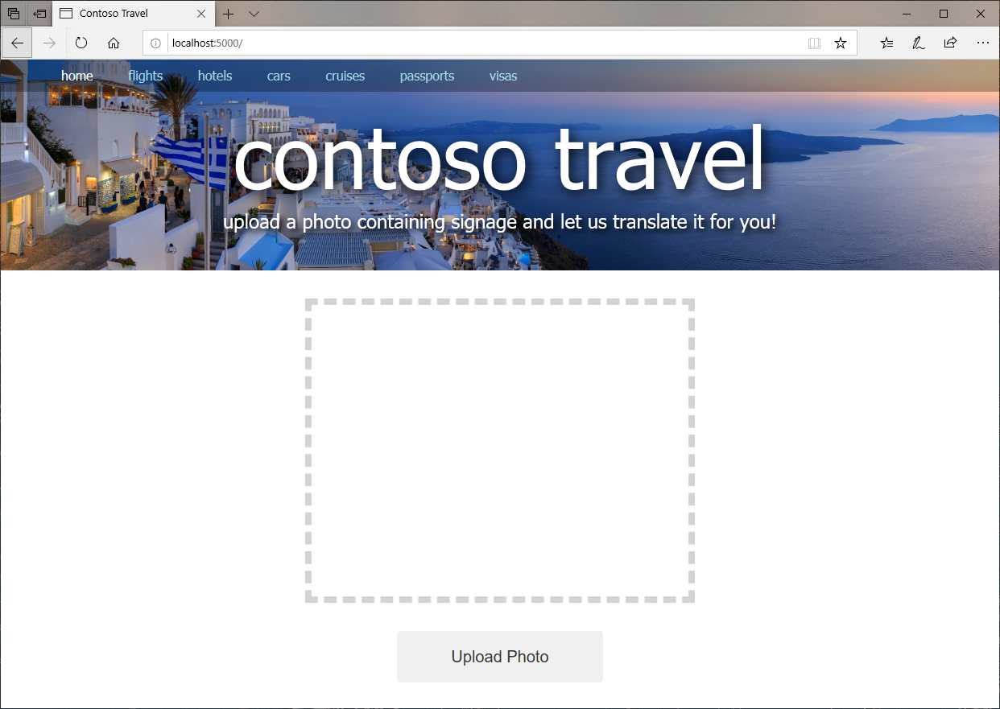
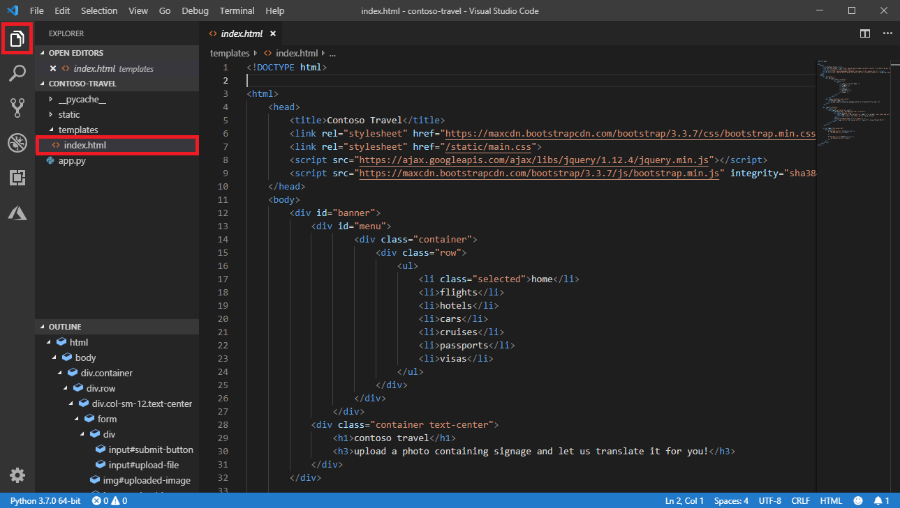
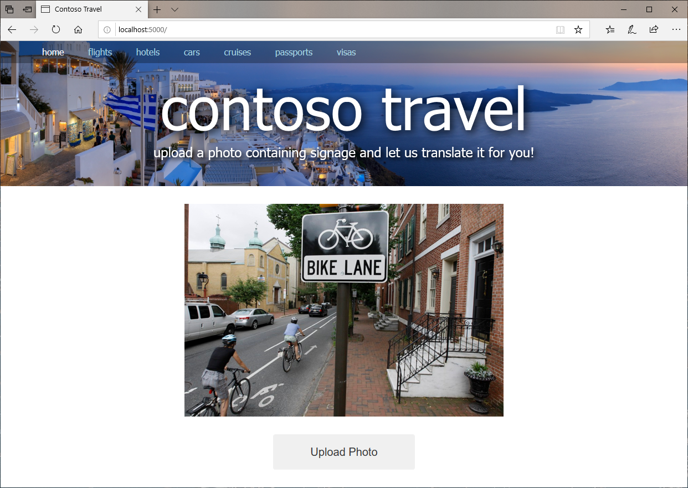

# Create a site that supports photo uploads

Now that you have an environment for Python and Flask prepared and have the basics of Flask under your belt, it's time to build a Web site. A Web site begins with an **app.py** file and basic assets such as HTML, CSS, and images. You will start by downloading a set of starter files for a Web site named "Contoso Travel." Then you will enhance the site to support photo uploads.

1. Create a directory on your hard disk in the location of your choice. This will be the *project directory* and will hold all of the files that comprise the Web site.

1. [Download a zip file](https://topcs.blob.core.windows.net/public/contoso-travel.zip) containing the assets for Contoso Travel and copy the contents of the zip file into the project directory you created in the previous step.

1. Take a moment to browse the files that you copied into the project directory. Verify that they include:

	- **app.py**, which holds the Python code that drives the site
	- **templates/index.html**, which contains the site's home page
	- **static/main.css**, which contains CSS to dress up the home page
	- **static/banner.jpg**, which contains the Web-site banner
	- **static/placeholder.jpg**, which contains a placeholder image for photos that have yet to be uploaded

	Here's what's in **app.py** right now:

	```python
	from flask import Flask, render_template
	
	app = Flask(__name__)
	
	# Define route for the app's one and only page
	@app.route("/")
	def index():
	    return render_template("index.html")
	```

	Currently, the app consists of a single page named **index.html** located in the "templates" subdirectory. **index.html** doesn't contain any special expressions at the moment — it is simply a static file — but that will change as you develop the site. **index.html** loads the popular [Bootstrap](https://getbootstrap.com/) framework and uses it to make the page responsive. It also loads **main.css** from the "static" subdirectory and uses the CSS styles defined there to lend the page a professional appearance.

1. Open a Command Prompt window or terminal and `cd` to the project directory.

1. If you are running Windows, execute the following command to create an environment variable named FLASK_ENV that tells Flask to run in development mode: 

	```
	set FLASK_ENV=development
	```

	If you are running Linux or macOS, use this command instead:

	```
	export FLASK_ENV=development
	```

	Running Flask in development mode is helpful when you're developing a Web site because Flask automatically reloads any files that change while the site is running. If you let Flask default to production mode and change the contents of an HTML file or other asset, you have to restart Flask to see the change in your browser.

1. Now use the following command to start Flask:

	```
	flask run
	```

1. Open a browser and navigate to http://localhost:5000. Confirm that the Web site appears in the browser as shown below.

	

	_Contoso Travel_

The page isn't functional yet. It doesn't support photo uploads, even though the user interface for doing so is in place. The next step is to modify the site to allow users to upload photos.

## Add support for uploading photos

In this exercise, you will modify **index.html** and **app.py** so users can upload photos to the Web site. You can use any text editor you'd like to do the editing, but we recommend using Visual Studio Code — Microsoft's free, lightweight source-code editor for Windows, macOS, and Linux that features IntelliSense, integrated Git support, and more.

1. If Visual Studio Code isn't installed on your PC, go to https://code.visualstudio.com/ and install it now.

1. Start Visual Studio Code and use the **File** > **Open Folder...** command to open the project directory containing the Web site.

1. Use Visual Studio Code's Explorer to open **index.html** in the "templates" folder. This is the Web site's home page, and the one that will be used to upload photos.

	

	_Opening index.html_

1. Paste the following `<script>` block into **index.html** immediately before the closing `</body>` tag near the bottom of the file:

	```html
	<script type="text/javascript">
	    $(function() {
	        $("#upload-button").click(function() {
	            $("#upload-file").click();
	        });
	
	        $("#upload-file").change(function() {
	            $("#submit-button").click();
	        });
	    });
	</script>
	```

	The purpose of this code is simple: to display an open-file dialog when the user clicks the page's **Upload Photo** button, and to upload the selected image when the dialog is dismissed. It works by using jQuery to simulate clicks of the buttons in a hidden file-upload control defined in **index.html**:

	```html
	<div style="display: none">
	    <input type="file" id="upload-file" name="file" accept=".jpg,.jpeg,.png,.gif">
	    <input type="submit" id="submit-button" value="Upload">
	</div>
	```

	This is a common trick used in Web pages to hide the default file-upload control and replace it with something that offers a better user experience and is more easily styled.

1. Open **app.py** in Visual Studio Code and replace its contents with the following statements:

	```python
	import base64
	from flask import Flask, render_template, request
	
	app = Flask(__name__)
	
	@app.route("/", methods=["GET", "POST"])
	def index():
	    if request.method == "POST":
	        # Display the image that was uploaded
	        image = request.files["file"]
	        uri = "data:;base64," + base64.b64encode(image.read()).decode("utf-8")
	
	    else:
	        # Display a placeholder image
	        uri = "/static/placeholder.png"
	
	    return render_template("index.html", image_uri=uri)
	```

	The revised **app.py** still serves up the content in **index.html** when the home page is requested. But when the user uploads a photo and the page is requested again with a POST command, the new code retrieves the uploaded image from the request (`image = request.files["file"]`), base-64 encodes it to create a [data URI](https://en.wikipedia.org/wiki/Data_URI_scheme), and assigns the data URI to the `` element declared in the page. This is a common technique for displaying an uploaded image in a Web page without writing the image to a temporary file on disk.

1. Return to **index.html** and find the `` element on line 42. Replace `/static/placeholder.png` on that line with `{{ image_uri }}`. Here is the modified line:  

	```html
	
	```

	What does this do? Notice the `image_uri` variable passed to `render_template()` in the modified **app.py** file. When the page is first requested, `image_uri` points to the placholder image. When the page is requested again because an image was uploaded, `image_uri` holds the data URI created from the image. Consequently, when the user uploads a photo, the photo replaces the placeholder image on the page. 

Finish up by saving your changes to **index.html** and **app.py**. It's time to see the results.

## Upload a photo

Let's make sure your changes have the desired effect by uploading a photo to the site.

1. Assuming Flask is still running in the project directory (if it's not, you can start it again with a `flask run` command), either refresh the page in your browser or open a new browser instance and navigate to http://localhost:5000.

1. Click the **Upload Photo** button and select a photo from your local file system.

1. Confirm that the photo you selected appears on the page:

	

	_Contoso Travel showing an uploaded photo_

You now have a basic Flask Web site running that accepts photo uploads. The next step is to modify the site to extract text from those photos. That's where Azure Cognitive Services come in.