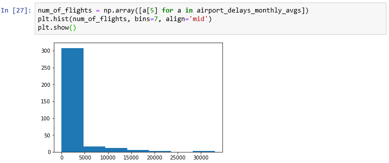
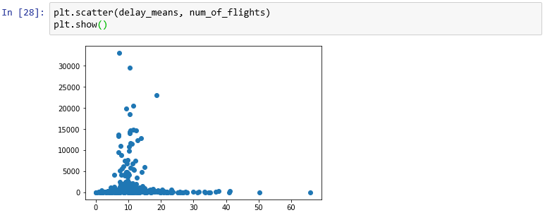

# Performing basic stats calculations with numpy

One of the features of NumPy is the ability to generate statistics based upon the values in a NumPy array. Generating statistics from a NumPy array should be much faster than using standard Python data structures such as lists. 

## Performing Calculations on an Array

In this exercise, various calculation functions provided by `numpy` and `scipy` will be explored. The selected functions are mostly those which are used to generate descriptive statistics on a set of data. Descriptive statistics focus on measures of center (center of the data) and measures of dispersion (how spread out is the data). Such measures are commonly employed to get a better understand of the data before moving on to more advanced techniques.

1. Create a new Jupyter notebook named 'NumPy Stats Exercise' in Azure Notebooks.

1. In the first cell, add the following code, and run the cell.

	```python
	import numpy as np
	```

1. Add a new cell, add the following code, and run the cell.

	```python
	nums = np.array([ 1, 2, 2, 2, 4, 5, 5, 7, 8, 8, 9 ])
	```
	
	Create a new NumPy array of integer values.

1. Add a new cell, add the following code, and run the cell.

	```python
	len(nums) # outputs: 11
	```

	The `len` function returns the number items in the array.

1. Add a new cell, add the following code, and run the cell.

	```python
	nums.sum() # outputs: 53
	```

	The `sum` function returns the sum of the items in the array.

1. Add a new cell, add the following code, and run the cell.

	```python
	nums.min() # outputs: 1
	```

	The `min` function is a measure of dispersion and returns the smallest value in the data set.

1. Add a new cell, add the following code, and run the cell.

	```python
	nums.max() # outputs: 9
	```

	The `max` function is a measure of dispersion and returns the largest value in the data set.

1. Add a new cell, add the following code, and run the cell.

	```python
	nums.ptp() # outputs: 8
	```

	The `ptp` or peak-to-peak function returns the range of the data, the difference between maximum and minimum value. The range is a measure of dispersion.

1. Add a new cell, add the following code, and run the cell.

	```python
	np.mean(nums) # outputs: 4.818181818181818
	```

	The `mean` is a measure of center and returns the average value. The mean is heavily influenced by outliers.

1. Add a new cell, add the following code, and run the cell.

	```python
	np.median(nums) # outputs: 5.0
	```

	The `median` is another measure of center and returns the middle item in the array. The median is not heavily influenced by outliers.

1. Add a new cell, add the following code, and run the cell.

	```python
	nums.var() # outputs: 7.421487603305784
	```

	The `var` function returns the variance of the data which is a measure of dispersion. The variables looks at the difference between each element and the mean of all of the elements. Each difference is squared, summed and the either divided the total number of items (population variance) or one less than the total number of items (sample variance). The NumPy `var` function returns the population variance. One downside to the variance is that all of the units are squared making it hard to reason about the variance relative to the mean.

1. Add a new cell, add the following code, and run the cell.

	```python
	nums.std() # outputs: 2.724240738867581
	```

	The standard deviation is the square root of the variance. The `std` function return the population standard deviation which is a measure of dispersion. Because the units of the standard deviation match the units of the mean it is very helpful in understanding the dispersion of the data relative to the mean.

1. Add a new cell, add the following code, and run the cell.

	```python
	from scipy import stats
	```

1. Add a new cell, add the following code, and run the cell.

	```python
	stats.mode(nums) # outputs: ModeResult(mode=array([2]), count=array([3]))
	```

	The `mode` is the element of the array which occurs most often. In this case, the element 2 occurs three times. Another way to think of mode as if an element was randomly selected from the array which element would be the most likely element to be selected? This most likely element is the mode.

1. Add a new cell, add the following code, and run the cell.

	```python
	stats.describe(nums)
	
	# outputs: DescribeResult(
	#   nobs=11,
	#   minmax=(1, 9),
	#   mean=4.818181818181818,
	#   variance=8.163636363636362,
	#   skewness=0.110590652858330,
	#   kurtosis=-1.4556202598201393
	# )
	```

	Generating various descriptive statistics individually works, but the `scipy` module provides a `describe` function which will generate a number of values all at once. The `nobs` mean number of observations or the length. The `minmax` is a tuple of the minimum and maximum value. The `mean` is the average of the values. The `var` is the sample variance. By taking the square root of the variable the standard deviation can be easily calculated. The `skewness` and `kurtosis` are both additional measures of dispersion.

## Generate a Histogram with Matplotlib

Matplotlib is very popular library for generating visualization of data. It is very customizable and has a very large and robust API for configuring just about everthing. In this exercise, we will take a quick look at generating simple visualization of data.

1. Create a new Jupyter notebook named 'NumPy Stats Exercise' in Azure Notebooks.

1. In the first cell, add the following code, and run the cell.

	```python
	%matplotlib inline
	
	import matplotlib.pyplot as plt
	```

	The first command `%matplotlib inline` is an IPython magic function instructing Jupyter notebooks to display the visualization inline within the notebook output. Because the `matplotlib` package is already installed in most Jupyter notebook installations, it simply needs to be imported.

1. Add a new cell, then add a new the following code to the cell, and run the cell.

	```python
	nums = np.round(np.random.randn(1000) * 10)
	print(nums)
	```

	The `randn` function generates an array of 1000 random numbers where the numbers are generate using a normal distribution. There will be a higher concentration of number at the center and fewer on the ends. Using a vectorized multiplication operation each number is multiplied by 10. Then using the `round` function from NumPy each number is rounded to a integer.

1. Add a new cell, add the following code to it, and run the cell.

	```python
	plt.hist(nums)
	plt.show()
	```

	The `hist` function will plot a histogram of the random numbers. The random numbers were pulled from a normal distribution so the histogram will be in the shape of a bell.

1. it is possible to specify the number of bins the value are placed in to generate the histogram. Using the `bins` argument set the number of bins to 20. Run the cell and observe the histogram.

	```python
	plt.hist(nums, bins=20)
	plt.show()
	```

## Calculating Some Basic Stats for Ontime Flight Data

The airline data exercise results in a Jupyter notebook which will load and analyze airport, state and ontime flight data from the Bureau of Transportation Statistics. In this sixth exercise within the module, the ontime flight data will be used to calculate some basic stats.

1. Open the Jupyter notebook named 'Airline Data Exercise' in Azure Notebooks. You may want to make a duplicate copy of this notebook before attempting this exercise.

2. Add a new cell to the bottom of the notebook and add the following code.

	```python
	airport_delays_monthly_avgs = []
	
	for airport_code in airport_codes:
	    airport = airports[airport_code]
	    airport_indexes = [ ontime_row[0].decode('UTF-8') == airport_code for ontime_row in ontime ]
	    airports_for_code = ontime[airport_indexes]
	    airport_dep_delays = airports_for_code['dep_delay']
	
	    dep_delays_mean = airport_dep_delays.mean()
	    dep_delays_std = airport_dep_delays.std()
	
	    airport_delays_monthly_avgs.append((
	        airport_code,
	        airport.city,
	        airport.state_name,
	        airport_dep_delays.mean(),
	        airport_dep_delays.std(),
	        len(airports_for_code)
	    ))
	
	print(len(airport_delays_monthly_avgs))
	```

	The variable `airport_indexes` will contain `True` for each index which matches the current `airport_code`. Using the `airport_indexes`, all of the matching flights for the origin airport are sliced out and the `dep_delay` column is extracted. Using the NumPy's built-in mean and standard deviation functions, the mean and standard deviation for departure delay in minutes is calculate for the airport. Combining the airport code, airport location data and calculated stats a values a new list named `airport_delays_monthly_avgs` is created.

	Run the code for the entire notebook using 'Restart & Run All' from the 'Kernel' menu. Ensure everything works properly. The execution of this cell will take about 5-10 mins. Ensure the output for the length is 345.

1. Add a new cell to the bottom of the notebook and add the following code.

	```python
	airport_delays_monthly_avgs.sort(key=lambda a: a[3], reverse=True)
	```

	This will sort the list data in descending order based upon mean of the airport departure delays. The value of index 3 is the mean. Run the cell.

1. Add a new cell to the bottom of the notebook and add the following code.

	```python
	with open('./airports_avg_delay_sorted.csv', 'w') as airports_delay_avg_delay_sorted_file:
	
	    airports_avg_delay_sorted_writer = csv.writer(
	        airports_delay_avg_delay_sorted_file,
	        delimiter=',',
	        quotechar='"',
	        quoting=csv.QUOTE_MINIMAL
	    )
	    
	    airports_avg_delay_sorted_writer.writerow([
	        'ORIGIN', 'ORIGIN_CITY', 'ORIGIN_STATE',
	        'DEP_DELAY_MEAN','DEP_DELAY_STDEV','NUM_OF_FLIGHTS'
	    ])
	    
	    for airport_delays_monthly_avg in airport_delays_monthly_avgs:
	        airports_avg_delay_sorted_writer.writerow(airport_delays_monthly_avg)
	```

	The list `airport_delays_monthly_avgs` is written to a CSV file named 'airports_avg_delay_sorted.csv'. Python's `csv` module will take care of formatting the CSV content correctly. The final outputed file will contain some basic statistics of departure delays at US airpots in the month of October 2018.

1. Add a new cell to the bottom of the notebook, add the following code, then run the cell.

	```python
	%matplotlib inline
	
	import matplotlib.pyplot as plt
	```

	Let's generate some plots of the data.

1. Add a new cell to the bottom of the notebook, add the following code, then run the cell.

	```python
	delay_means = np.array([a[3] for a in airport_delays_monthly_avgs])
	plt.hist(delay_means, bins=7, align='mid')
	plt.show()
	```

	The first plot is a histogram of the delay in minutes per airport. Most the delay lengths occur at the lower range (this is good for flyers).

	

	_Charting airport delays_

1. Add a new cell to the bottom of the notebook, add the following code, then run the cell.

	```python
	num_of_flights = np.array([a[5] for a in airport_delays_monthly_avgs])
	plt.hist(num_of_flights, bins=7, align='mid')
	plt.show()
	```

	The second plot is a histogram of the number of flights per airport. Most airports are doing less than 5000 flights per month.

	

	_Charting numbers of flights_

1. Add a new cell to the bottom of the notebook and add the following code.
	
	```python
	plt.scatter(delay_means, num_of_flights)
	plt.show()
	```

	A scatter plot does an x,y plot of two variables. Scatter plots are used for variety of purposes including trying to discover relationships between two different variables. This is a scatter plot of the delay in minutes versus the number of flights at the same airpot. Not much information can be gained from this particular scatter plot except to say that high volume airports appear to do well in terms of keeping delays to a minimum.

	

	_Charting tk_