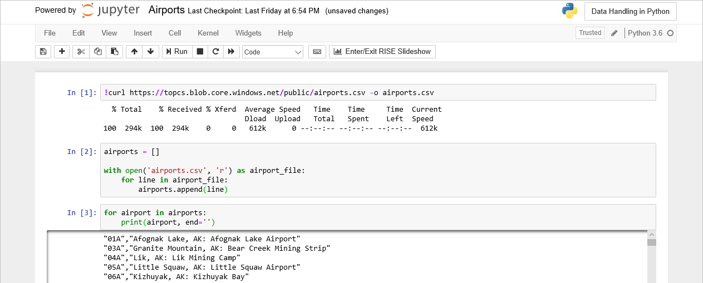
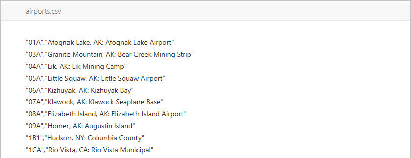

# Exercise: Build an airport directory

In order to try your hand with Python and some of the libraries that make it a great language for analyzing and manipulating data, you need an environment in which to execute Python code. You could install Python on your computer. It's included in most Linux distributions, but if you're running Windows, chances are it has to be installed separately.

An alternative, and one widely used by Python porgrammers, is Jupyter notebooks. Jupyter is an environment based on [IPython](https://ipython.org/) that facilitates interactive programming and data analysis using a variety of programming languages, including Python. Jupyter notebooks enjoy widespread use in research and academia for mathematical modeling, machine learning, and statistical analysis. [Azure Notebooks](https//notebooks.azure.com) provide Jupyter as a service for free. It's a convenient way to build notebooks and share them with others without having to install and manage a Jupyter server. And it's completely Web-based, making it an ideal solution for collaborating online.



In this lesson, you will log into Azure Notebooks using your Microsoft account, create your first notebook, and apply some of the principles learned in previous lessons to crack open a CSV file containing information about more than 6,000 U.S. airports and create a dictionary that maps airport codes to cities and states.

## Create a notebook

Azure notebooks are created through the portal at https://notebooks.azure.com and require nothing more than a browser and a [Microsoft account](https://account.microsoft.com/account). Notebooks are contained in projects, whose primary purpose is to group related notebooks. In this exercise, you will create a new project and then create a notebook inside it.

1. Navigate to https://notebooks.azure.com in your browser and sign in using your Microsoft account. Click **My Projects** in the menu at the top of the page. Then click the **+ New Project** button at the top of the "My Projects" page.

1. Create a new project named "Data Handling in Python." Check the "Public" box if you'd like to share notebooks with other people later on. You can also go into project settings once a project is created and change its visibility to public or private. 

	

	_Creating a project_

1. Click **+ New** and select **Notebook** from the menu to add a notebook to the project.

	

	_Adding a notebook to the project_

1. Name the notebook "Airports.ipynb," and select **Python 3.6** as the language. This will create a notebook with a Python 3.6 kernel for executing Python code. One of the strengths of Azure notebooks is that you can use different languages by choosing different kernels.

	

	_Creating a notebook_

	If you're curious, the **.ipynb** file-name extension stands for "IPython notebook." Jupyter notebooks were originally known as IPython (Interactive Python) notebooks, and they only supported Python as a programming language. The name Jupyter is a combination of Julia, Python, and R — the core programming languages that Jupyter supports.

1. Click the notebook to open it for editing.

You can create additional projects and notebooks as you work with Azure Notebooks. You can create notebooks from scratch, or you can upload existing notebooks. And once a notebook is created or uploaded, you can take advantage of Azure compute resources to run the notebook and leverage popular Python libraries such as [Keras](https://keras.io/), [NumPy](http://www.numpy.org/), [Pandas](https://pandas.pydata.org/), [Matplotlib](https://matplotlib.org/), and [Scikit-learn](https://scikit-learn.org/stable/index.html).

## Build a dictionary of airport codes

The U.S. [Bureau of Transportation Statistics](https://www.transtats.bts.gov/) (BTS) maintains a wealth of information regarding transportation in the United States and makes much of the data available to the public. One of the datasets you can download from the BTS Web site lists all the airports in the U.S. and includes their 3-letter airport codes, the cities they're located in, and their names. In this exercise, you will use that dataset to create a dictionary of airport codes.

1. Enter the following statement in the notebook's first cell and click the **Run** button to execute it:

	```bash
	!curl https://topcs.blob.core.windows.net/public/airports.csv -o airports.csv
	```

	This statement uses Bash's `curl` command to download a CSV file from Azure blob storage. You can execute Bash commands in Azure notebooks by preceding them with exclamation points (!). Once a file is downloaded this way, it doesn't have to be downloaded again. It's saved in the project along with the notebooks that the project contains.

	

1. Return to the "Data Handling in Python" project page in your browser. Refresh the page, and click **airports.csv** to view the contents of the CSV you just downloaded. Observe that each line contains a 3-letter airport code, the city and state in which the airport is located, and the airport name:

	

1. Return to the notebook and run the following code in the next cell to open **airports.csv**, read each line, and add it to a list:

	```python
	airports = []
	
	with open('airports.csv', 'r') as airport_file:
	    for line in airport_file:
	        airports.append(line)
	```

1. Now use the following code to print the list:

	```python
	for airport in airports:
	    print(airport, end='')

	```

	Confirm that the output looks like this:

	

1. So far, so good. But a list of strings has limited value since it can't easily be used to do lookups. Rather than create a list, let's use string splitting and slicing to extract the airport code and location (city and state) from each line, and build a dictionary in which the keys are airport codes and the values are airport locations:

	```python
	airports = {}
	
	with open('airports.csv', 'r') as airport_file:
	    for line in airport_file:
	        split_line = line.split('","')
	        code = split_line[0][1:]
	        location = split_line[1].split(': ')[0]
	        airports[code] = location
	``` 

	This code splits the string read from the file at '","' to produce a pair of substrings. The quotation mark is removed from the beginning of the first substring to produce an airport code. Then the second substring is split at ': ' to produce two more substrings, the first of which is the airport location.

1. Use the following statements to print the dictionary:

	```python
	for key, value in airports.items():
	    print(key + ' = ' + value)
	```

	Confirm that the output looks like this:

	

1. Use the following statement to retrieve the value keyed by "TYS" from the dictionary:

	```python
	airports['TYS']
	```

In what city and state is TYS located? Later on, if you need to convert airport codes into cities and states, would this dictionary be helpful?

## Use a dictionary comprehension

The code that parses the CSV file and builds a dictionary of airport codes works, but it can be written much more concisely using a comprehension. Before you read further, can you picture how that comprehension would look?

1. Return to the notebook and run the following code in a new cell:

	```python
	with open('airports.csv', 'r') as airport_file:
	    split_line = line.split('","')
	    airports = { split_line[0][1:]:split_line[1].split(': ')[0] for line in airport_file }
	```

	Do you recognize the dictionary comprehension? Note that these three lines could be reduced to two by repeating `line.split('","')` inside the comprehension, but doing so would adversely impact performance by performing the same operation twice each time through the loop. 

1. Now print the dictionary and confirm that the output is the same as before:

	```python
	for key, value in airports.items():
	    print(key + ' = ' + value)
	```

1. Finish up by selecting **Save and Checkpoint** from the notebook's **File** to save your work.

This simple exercise combined several of the concepts you learned in the first two lessons, including lists, dictionaries, strings and string slicing, and comprehensions. You will see these concepts again. But first, there's another important data structure that you need to learn about: NumPy arrays.