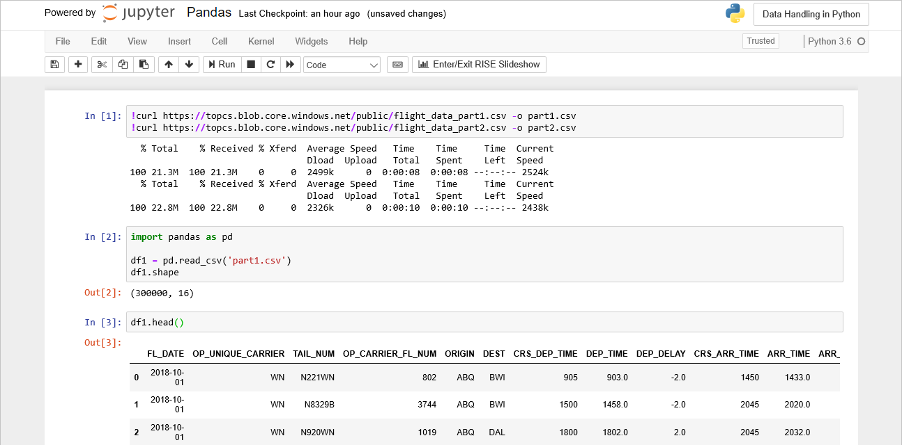
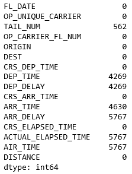
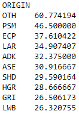

# Use Pandas to merge and analyze complex datasets

It's late on Friday afternoon and you've been given two large CSV files containing on-time arrival information for hundreds of thousands of flights. The data is "dirtied" with duplicate rows and missing values, the latter resulting from a combination of incomplete records and flights that never arrived at their destinations because they were canceled or diverted. Your job is to merge the two datasets into one, clean it, and answer basic questions such as what percentage of flights arrived on time, and which airports exhibit the worst on-time performance.

In this lesson, you will use a Jupyter notebook to put Pandas to work cleaning and analyzing data. Using pure Python, you'd be in for a long weekend. But with Pandas doing the heavy lifting, you'll be off for a weekend getaway before most of your colleagues punch the clock to head home.



## Load data from CSV files

The first challenge is to load the CSV files and produce a single DataFrame. The `read_csv()` and `append()` methods that you learned about in the previous lesson should make short work of both.

1. Begin by returning to [Azure Notebooks](https://notebooks.azure.com) and creating a new notebook named "Pandas" in the "Data Handling in Python" project that you created earlier. Select Python 3.6 as the language.

1. Run the following statements in the notebook's first cell to import a pair of CSV files from Azure blob storage:

	```bash
	!curl https://topcs.blob.core.windows.net/public/flight_data_part1.csv -o part1.csv
	!curl https://topcs.blob.core.windows.net/public/flight_data_part2.csv -o part2.csv
	```

1. Now paste the following statements into the next cell to load the first CSV file into a DataFrame and show the number of rows and columns:

	```python
	import pandas as pd

	df1 = pd.read_csv('part1.csv')
	df1.shape
	```

1. Call `head()` on the DataFrame to display the first five rows:

	```python
	df1.head()
	```

1. Use these statements to load the second CSV file and show the number of rows and columns:

	```python
	df2 = pd.read_csv('part2.csv')
	df2.shape
	```

1. Call `head()` on the DataFrame to display the first five rows:

	```python
	df2.head()
	```

1. It appears that the datasets share the same schema. Use the `append()` method to merge the two and produce a DataFrame containing all rows from both datasets, and `shape` to confirm that the combined DataFrame contains 620,000 rows:
  
	```python
	df = df1.append(df2, ignore_index=True)
	df.shape
	```

That wasn't difficult, but there is more to do before you apply the first analytical method to the data. In the real world, data is rarely ready to consume as is. This dataset is no exception.

## Clean the data

Like most datasets, this one needs to be cleaned before it's subjected to analysis. Let's first identify the problems, and then use Pandas to whip the dataset into shape.

1. A quick and easy way to determine whether a DataFrame has duplicate row is to use the DataFrame's [`duplicated()`](https://pandas.pydata.org/pandas-docs/stable/reference/api/pandas.DataFrame.duplicated.html) method, which selects all the rows in the dataset that have duplicates. Use the following statement to determine if there are duplicate rows, and if so, how many:

	```python
	len(df[df.duplicated()])
	```

	Does the dataset contain duplicate rows? If so, how many?

1. You don't want to remove *all* of the duplicate rows. You want to remove the duplicates, leaving behind one copy of each duplicated row. Use the following lines of code to remove duplicate rows from the dataset and count the remaining rows:

	```python
	df = df.drop_duplicates()
	df.shape
	```

	How many rows were dropped from the dataset? How many remain?

1. Use this statement to list the columns in the dataset and show the number of missing values in each:

	```python
	df.isnull().sum()
	```

	Confirm that the output looks like this:

	

1. The TAIL_NUM column is missing some values, but it won't be used in any of your analyses, so use the following statement to remove it from the DataFrame:

	```python
	del df['TAIL_NUM']
	```

1. Most of other missing values are missing due to flights that were canceled or diverted to other destinations. Let's remove those rows from the DataFrame to prevent them from skewing any statistics:

	```python
	df = df.dropna()
	```

1. Use `df.isnull().sum()` again to examine the DataFrame for missing values. Does the dataset appear to be in better shape this time?

1. Finish up by displaying the dimensions of the Dataframe:

	```python
	df.shape
	```

How many rows and columns does the final DataFrame contain?

## Analyze the data

Like NumPy, Pandas includes methods for performing mathematical operations on DataFrames. Let's use some of these methods (and others) to learn more about the hundreds of thousands of flights contained in the two CSV files.

1. Use the following statement to compute the average delay for all 600,000+ flights represented in the dataset:

	```python
	df['ARR_DELAY'].mean()
	```

	If you wanted to determine the longest delay incurred by any flight, how would you do it?

1. One of the lesser-known features of DataFrames is that you can include filters in expressions that select data. To demonstrate, use the following statement to determine how many flights were 10 minutes or more late:

	```python
	len(df[df['ARR_DELAY'] >= 10])
	``` 

1. Perhaps more interesting is the *percentage* of flights that arrived 10 minutes or more late. Try this and see if it does what you want:

	```python
	percent = len(df[df['ARR_DELAY'] >= 10]) / df.shape[0]
	print('{0:.1%}'.format(percent))
	```

	There are many ways to determine the number of rows in a DataFrame, but `shape[0]` is among the fastest and the most straightforward. Not surprisingly, `shape[1]` is a quick way to count the columns in a DataFrame.

1. Now suppose you want to know what the average departure delay was for flights originating from a single airport — say, Atlanta (ATL). That shouldn't be hard given that you can combine a filter with a call to `mean()`:

	```python
	df[df['ORIGIN'] == 'ATL']['DEP_DELAY'].mean()
	```

	Based on the results, would you say that flights from Atlanta departed relatively on time?

1. A final question that you might ask is "Which 10 airports are the worst for departure delays?" DataFrame's `groupby()` method can play a role here by grouping flights by origin. This also presents you with the opportunity to combine several of the techniques you've learned about to compute averages, sort the data in descending order, and provide a row count to `head()`:

	```python
	df.groupby('ORIGIN')['DEP_DELAY'].mean().sort_values(ascending=False).head(10)
	```

1. Confirm that the output looks like this, which indicates that Southwest Oregon Regional Airport (OTH) is not the place you'd prefer to fly out of if given a choice:

	

These examples merely scratch the surface of what you can accomplish with Pandas. Use them as a starting point for examples of your own — and a lever for getting off work early on Fridays.