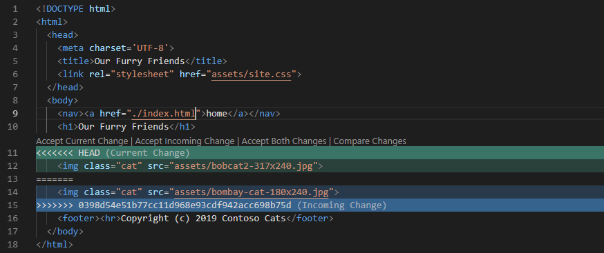

# Resolve merge conflicts

Sometimes, no matter how well you plan, things go wrong. Imagine that two developers are working on the same file at the same time and change the same line. When they push their changes, the second one will experience a *merge conflict*. Deveolopers using version control dread few things more than merge conflicts. But conflicts happen, and you best — no, *must* — know how to deal with them.

The good news is that Git provides solutions for dealing with merge conflicts. In this unit, you will learn about two of them. 

## Make a change as Alice

Let's started by taking on Alice's role again and making a change to the Web site's home page by replacing the picture of Bob's cat with a picture of Alice's.

1. Navigate to the "Alice" directory and configure Git to use Alice's credentials:

	```bash
	cd ../Alice
	git config user.name Alice
	git config user.email alice@contoso.com
	``` 

1. Create a branch named "add-cat" to work in:

	```bash
	git checkout -b add-cat
	```

1. Copy **bombay-cat-180x240.jpg** from [insert location here] into Alice's "assets" directory. Then open **index.html** and replace this line:

	```html
	
	```

	With this one:

	```html
	
	```

	Then save the file.

1. Now commit the changes, switch back to "master," do a pull to make sure nothing has changed, merge the "add-cat" branch into "master," and push:

	```bash
	git add assets
	git commit -a -m "Add picture of Alice's cat"
	git checkout master
	git pull
	git merge --ff-only add-cat
	git push
	```

Finish up by confirming that the push succeeded.

## Make a change as Bob

Without knowing what Alice is doing, Bob notices that Alice's last push added a CSS style named `cats` to **site.css**. So he decides to apply that class to his cat picture.

1. Start by assuming the role of Bob:

	```bash
	cd ../Bob
	git config user.name Bob
	git config user.email bob@contoso.com
	```

1. Create a branch named "style-cat" to work in:

	```bash
	git checkout -b style-cat
	```

1. Open **index.html**, add a `class="cat"` attribute to the `` element, and save the file:

	```html
	
	```

1. Now commit the change, switch back to "master," and do a pull:

	```bash
	git commit -a -m "Style Bob's cat"
	git checkout master
	git pull
	```

	And there it is: the dreaded merge conflict. The same line in the same file was changed by two people. Git sees that and reports "Updates were rejected because the remote contains work that you do not have locally." Git has no way of knowing whether the `src` attribute in the `` element should reference **bobcat2-317x240.jpg** or **bombay-cat-180x240.jpg**:

	```
	remote: Counting objects: 3, done.
	remote: Compressing objects: 100% (3/3), done.
	remote: Total 3 (delta 2), reused 0 (delta 0)
	Unpacking objects: 100% (3/3), done.
	From D:/Labs/Git/Bob/../Shared
	   e02d9e3..0398d54  master     -> origin/master
	Auto-merging index.html
	CONFLICT (content): Merge conflict in index.html
	Automatic merge failed; fix conflicts and then commit the result.
	```

	If Bob tried to do a push right now, that would fail, too:

	```
	 ! [rejected]        master -> master (fetch first)
	error: failed to push some refs to 'D:/Labs/Git/Bob/../Shared.git'
	hint: Updates were rejected because the remote contains work that you do
	hint: not have locally. This is usually caused by another repository pushing
	hint: to the same ref. You may want to first integrate the remote changes
	hint: (e.g., 'git pull ...') before pushing again.
	hint: See the 'Note about fast-forwards' in 'git push --help' for details.
	```

The question now is: What's Bob to do?

## Resolve the merge conflict

Bob has a few options at this point. One is to use `git merge --abort` to restore "master" to what it was before the attempted merge. Bob could then do a pull to get Alice's changes, create a new branch, make his changes, merge the branch into "master," and push his changes. Bob could also use `git reset --hard` to get back to where he was.

The preferred option in many cases is to resolve the conflict using information Git inserted into the affected files. When Git detects a conflict in a file, it inserts *both* conflicting versions into the file between lines starting with `<<<<<<<`, `=======`, and `>>>>>>>`.  The part before the `=======` line is "your" side of the merge — the branch you were already on — and the part after is "their" side -- the branch you specified in the `merge` command.

In this case, **index.html** in Bob's repo looks like this:

```html
<!DOCTYPE html>
<html>
  <head>
    <meta charset='UTF-8'>
    <title>Our Furry Friends</title>
    <link rel="stylesheet" href="assets/site.css">
  </head>
  <body>
    <nav><a href="./index.html">home</a></nav>
    <h1>Our Furry Friends</h1>
<<<<<<< HEAD
    
=======
    
>>>>>>> 0398d54e51b77cc11d968e93cdf942acc698b75d
    <footer><hr>Copyright (c) 2019 Contoso Cats</footer>
  </body>
</html>
```

Knowing this, let's resolve the merge by editing **index.html**. Because this is a quick fix, you will make the change directly in the "master" branch.

1. Open **index.html**, delete these three lines, and then save the file:

	```html
	<<<<<<< HEAD
	=======
	>>>>>>> 0398d54e51b77cc11d968e93cdf942acc698b75d
	```

	**index.html** now has two `` elements: one for Bob's cat and one for Alice's.

	As an aside, some text editors feature Git integration and offer to help when they see text representing merge conflicts. For example, if you open **index.html** in [Visual Studio Code](https://code.visualstudio.com/), you'll see this:

	

	_Resolving merge conflicts in Visual Studio Code_

	Clicking **Accept Both Changes** removes the lines around the `` elements and leaves both elements intact.

1. Now commit the change:

	```bash
	git add index.html
	git commit -a -m "Style Bob's cat"
	```

	The `git add` command tells Git that the conflict in **index.html** has been resolved.

1. Push the changes to "master" on the remote:

	```bash
	git push
	```

	This time it should work, unless "master" on the remote changed again while Bob was working.

Finish up by opening Bob's **index.html** in your browser. How many furry felines do you see?