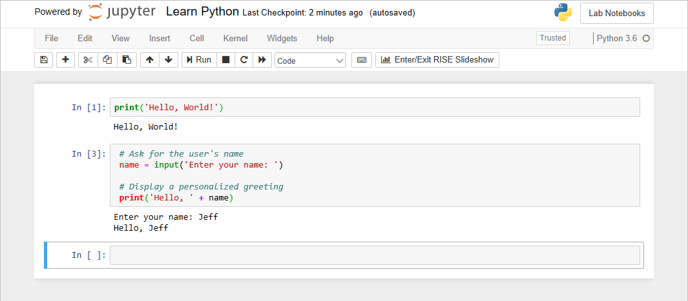
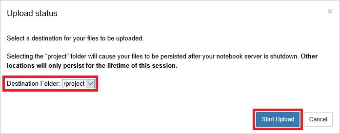
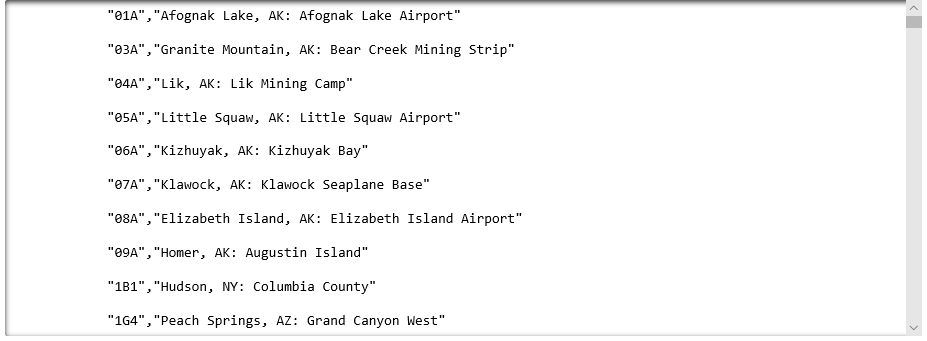
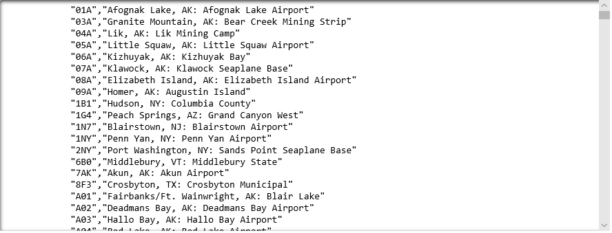

# Reading, looping, and lists in Python

The U.S. [Bureau of Transportation Statistics](https://www.transtats.bts.gov) (BTS) maintains a wealth of information regarding transportation in the United States and makes much of that data available to the public. One of the datasets you can download from the BTS Web site lists all the airports in the world and includes their three-letter airport codes, the cities they're located in, and their names.

In this lesson, you will download that dataset from the BTS Web site, upload it to Azure Notebooks, and load it into the notebook you created in the previous lesson. Along the way, you will learn how to read files in Python and how to perform basic looping using `for-in` statements. In addition, you will learn about one of Python's most important data types: lists, which hold collections of data.

## Download a CSV file containing airport data

The first step is to download the dataset and have a look at its content and structure. The dataset is a text file containing [CSV](https://en.wikipedia.org/wiki/Comma-separated_values) data. CSV is an extremely common data format — so common that there are Python libraries whose only purpose is to simplify reading and writing CSV files.

1. [Click here](https://www.transtats.bts.gov/Download_Lookup.asp?Lookup=L_AIRPORT) to open your browser and download a CSV file containing a collection of airport codes, airport locations, and airport names from the BTS Web site. Save the file to the location of your choice and name it **airports.csv**.

	> The file that you're downloading has a .csv\_ file-name extension. Even if you tell the browser to name it **airports.csv**, the file may be saved with a .csv\_ extension. If that happens, rename the file so that it ends in .csv. 

1. Once the download is complete, open **airports.csv** in your favorite text editor. Take a moment to browse the contents of the file:

	```
	Code,Description
	"01A","Afognak Lake, AK: Afognak Lake Airport"
	"03A","Granite Mountain, AK: Bear Creek Mining Strip"
	"04A","Lik, AK: Lik Mining Camp"
	"05A","Little Squaw, AK: Little Squaw Airport"
	"06A","Kizhuyak, AK: Kizhuyak Bay"
	"07A","Klawock, AK: Klawock Seaplane Base"
	"08A","Elizabeth Island, AK: Elizabeth Island Airport"
	"09A","Homer, AK: Augustin Island"
	"1B1","Hudson, NY: Columbia County"
	 .
	 .
	 .

	```

	Observe that the first line is a header containing column names. Each line thereafter contains information regarding a specific airport. Furthermore, each line begins with a quoted string containing an airport code (for example, "JFK" for John F. Kennedy airport in New York), and ends with another quoted string containing the airport's location and name, separated by a colon.

How many airports are represented in the file? How would you determine how many of those airports are located in the U.S.? How easy would it be to determine how many airports are located in a specific state such as Tennessee (TN) or Virginia (VA)?

## Reading files in Python

In order to load this data into a notebook, you need to know how to read files in Python. Suppose you have a text file named **colors.txt** that contains the following lines:

```
red
green
blue
```

The first step in reading the file is opening it. For this, Python provides the `open` function:

```python
color_file = open('colors.txt', 'r')
```

The 'r' passed in the second parameter indicates that the file is being opened for reading. Other valid specifiers include 'w' for writing and 'a' for appending. One difference between 'w' and 'a' is that the former effectively deletes the file if it already exists, while the latter does not. You can also specify 'r+' to open the file for reading *and* writing.

Once a file is opened for reading, you can read it line for line this way:

```python
for color in color_file:
    print(color)
```

The `for-in` loop is the main looping construct in Python. In this example, the `print` statement executes once for each line of text in `color_file`. Once reading is complete, the file should be closed to conserve operating-system resources:

```python 
color_file.close()
```

Python supports a handy syntax using the `with` keyword that automatically closes the file at the end of the block. Rather than write this:

```python
color_file = open('colors.txt', 'r')
for color in color_file:
    print(color)
color_file.close()
```

You can write this:

```python
with open('colors.txt', 'r') as color_file:
    for color in color_file:
        print(color)
```

Now you can't forget to close the file, and it gets closed even if an error occurs as the `with` block executes.

### Looping

The previous example used a `for-in` loop to read lines from a text file. There are two kinds of loops in Python: `for-in` loops and `while` loops. The `for-in` loop iterates over each item in a collection of data. The `while` loop iterates while a conditional expression evaluates to true.

The following code creates a list of numbers 0 through 9 and prints each of them using a `for-in` loop:

```python
nums = range(10)
for x in nums:
    print(x)
```

The output is exactly what you would expect:

```python
0
1
2
3
4
5
6
7
8
9
```

Here's the same code written as a `while` loop:

```python
x = 0
while x < 10:
    print(x)
    x = x + 1
```

If you wanted to reverse the order of the output, how would you modify the `while` loop to do it?

### Indenting your code

The indented lines in the code samples are no accident. In most programming languages, indentations are used to make the code more readable, but have no bearing on the meaning or validity of the code. Python is different. It is one of the few programming languages in which indentations are significant.

As a rule, indentation is required after a line that ends with a colon. The following statement reports an indentation error if executed:

```python
for color in color_file:
print(color) # no indent!
```

These statements execute just fine, but they result in an infinite loop:

```python
x = 0
while x < 10:
    print(x)
x = x + 1
```

Consecutive lines that are indented the same signify blocks of code and are treated as a unit. If you want to include 10 lines of code in a `while` loop or `for-in` loop, make sure all 10 lines are indented by the same amount.

### Load the CSV file into your notebook

Now let's use what you learned about files and loops to open **airports.csv** and display its contents in your notebook.

1. Return to the Azure notebook that you created in the previous lesson.

	

	_Jupyter notebook in Azure_

1. Use the **File -> Upload...** command to upload **airports.csv** from your local hard disk. Set "Destination folder" to **~/project** so the file will be stored durably rather than just for the length of the session.

	

	_Uploading airports.csv_

1. Add the following Python statements to the empty cell at the end of the notebook:

	```python
	with open('airports.csv', 'r') as airport_file:
	    airport_file.readline() # Skip header line
	    for airport in airport_file:
	        print(airport)
	```

	This code opens **airports.csv** for reading and reads it a line at a time, printing each line that it is read.

1. Run the cell and confirm that the output looks like this:

	

	_Printing the contents of the data file_

1. Why is there a blank line between every line of output? Because each line that was read from the text file ends with a newline character, and `print` adds a newline of its own. In Python 3, there is an easy solution to this. Modify the `print` statement in the previous cell to pass a second parameter to the `print` function:

	```python
	print(airport, end='')
	```

	The second parameter tells `print` to end the line with an empty string rather than a newline character. It leverges the fact that in Python, you can use parameter names to specify parameter values in function calls without providing values for *all* parameters. `end` is an example of a *named parameter*, a subject that you will learn more about in a subsequent lesson.

1. Run the cell again. How does the output differ from before?

1. Scroll to the bottom of the output and confirm that the final line is formatted differently than all the others:

	```
	"ZZZ","Unknown Point in Alaska"
	```

The extraneous line isn't harmful, but later on, you will want to ignore it when parsing individual lines in the data file.

## Using lists in Python

One of the fundamental data types in Python is the *list*. A list is a collection of items of any data type — integers, strings, even other lists, and so on — and is analogous to arrays in other programming languages. Lists are mutable (they can be changed), which means items can be added and removed from them.

> The terms *mutable* and *immutable* are frequently used in the programming. Mutable means the memory referenced by a variable can be changed. Immutable means the memory referenced by a variable cannot be changed. For example, strings are immutable. If you modify a string in code, a new string is created in memory to hold the modified string. Lists are mutable, meaning items can freely be added and removed.

To create a list, you can wrap a sequence of values in square brackets and separate each item in the list with commas. The following example creates a list of integers:

```python
nums = [1,2,3,4,5]
```

To access an item in the list, specify its zero-based index in square brackets:

```python
print(nums[2]) # outputs: 3
```

One of the most useful features that lists support is *slicing*, which allows you to easily extract a subset of the list. Slicing is performed by specifying a starting index and ending index in square brackets. The following code extracts three characters from a list and prints them to the screen. Note that the last item included in the slice is the item whose index is the ending index minus 1:

```python
nums = [1,2,3,4,5]
print(x[1:4]) # outputs: [2,3,4]
```

You can omit the starting index to specify that the slice should start with the first item in the list:

```python
nums = [1,2,3,4,5]
print(x[:4]) # outputs: [1,2,3,4]
```

And you can omit the ending index to specify that the slice should end with the final item in the list:

```python
nums = [1,2,3,4,5]
print(x[2:]) # outputs: [3,4,5]
```

Python is famous for its slicing capabilities. The ability to slice data is heavily used in Python applications, especially when performing numerically intensive tasks such as statistical analysis and machine learning.

Adding an item to the end of a list is simple:

```python
nums = [1,2,3,4,5]
nums.append(6)
print(nums) # outputs: [1,2,3,4,5,6]
```

Removing an item from the list is equally simple:

```python
nums = [1,2,3,4,5]
nums.remove(4)
print(nums) # outputs: [1,2,3,5]
```

To find the number of items in a list, use Python's built-in `len` function:

```python
nums = [1,2,3,4,5]
print(len(nums)) # outputs: 5
```

How might lists help when reading text files? The following code reads **colors.txt** line for line and adds each line to a list:

```python
colors = []
with open('colors.txt', 'r') as color_file:
    for color in color_file:
        colors.append(color)
```

Now you can use a `for-in` loop to iterate over the contents of the file:

```python
for color in colors:
    print(color)
```

And a simple `len` statement would tell you precisely how many lines the file contains.

### Store the contents of the CSV file in a list

Earlier, you modified your Azure notebook to read **airports.csv** and print it to the screen. Now let's modify that logic to store the lines read from the file in a list.

1. Add the following Python to the empty cell at the end of the notebook:

	```python
	all_airports = []

	with open('airports.csv', 'r') as airport_file:
	    airport_file.readline() # Skip header line
	    for airport in airport_file:
	        all_airports.append(airport)

	all_airports = all_airports[:len(all_airports) - 1]
	```

	Rather than print lines to the screen, this code declares an empty list named `all_airports` and appends each line read from the file to the list. It also removes the final line from the list since that line is something of an outlier.

1. Run the cell and verify that it executes without error. Then add the following statements to the empty cell at the end of the notebook to print the contents of the list:

	```python
	for airport in all_airports:
	    print(airport, end='')
	```

1. Run the cell and confirm that the output looks like this:

	

	_Printing the contents of the data file_

1. Finish up by using the **File** -> **Save and Checkpoint** command to save the notebook.

The data file has been uploaded to Azure Notebooks and loaded into a list, but right now it's nothing more than a list of strings containing airport codes, locations, and names. The strings need to be parsed to extract information regarding individual airports. Parsing requires that you learn a little more about strings in Python. That's the subject of the next lesson.