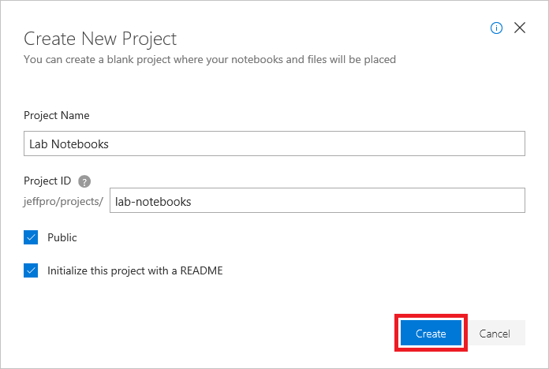
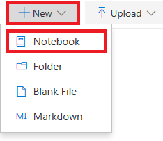

# Create an Azure notebook

The first step in learning Python is setting up a Python programming environment. There are several ways to utilize Python. One common way is to download Python from the Python website: [https://www.python.org](https://www.python.org). The website will provide an installer and source code to enable installing Python on a myriad of environments including Microsoft Windows, Apple's macOS, and all Linux distributions. In addition to the standard Python distribution, there are specialized distributions such as Anaconda, [https://www.anaconda.com](https://www.anaconda.com). Anaconda is a specialized distribution for scientific programming including data science and machine learning. Another popular way to get started with Python is through Jupyter Notebooks, [https://jupyter.org](https://jupyter.org).

Jupyter Notebooks is a web application which enables developers to write and execute Python programs within a web browser. They are great for learning Python and performing various experiments such as training a machine learning model. Jupyter Notebooks can be launched from within the Anaconda distribution on a local machine or used in the cloud through a service such as Azure Notebooks: [https://notebooks.azure.com](https://notebooks.azure.com).

In this course, Azure Notebooks will be used to write and execute all of the code. This will enable you to get up and running will little setup as well as explore the great Jupyter Notebook service which Azure provides. To get started visit, [https://notebooks.azure.com](https://notebooks.azure.com), register for an account (or sign in with an existing Microsoft Azure Account) to get started.

## Get started with Python

TODO: Add introduction.

### Writing output to the screen

In Python, the `print` statement outputs data to the screen. The following line of code displays "Hello World!" on the screen:

```python
print('Hello World!')
```

> Technically, the `print` outputs to `stdout`, which is short for *standard output*. The default destination for output written to `stdout` is the screen. It is possible (but beyond scope of this tutorial) to change the destination of `stdout`. Changing the destination of `stdout` would change the destination of the print statement.

The data to be displayed is passed as an argument to the `print` statement. Arguments are used to pass data to statements and functions. In this case, the data is a sequence of characters known as a *string*. The string includes all of the text in single quotes but does not include the quotation marks themselves. Strings are one of the most common data types used in computer programs. Python has extensive support for strings and provides many useful features for working with them.

### Reading keyboard input

`input` is used to read input from the keyboard. Unlike `print`, which is a statement, `input` is a *function*. A statement is a command that runs some code but does not return a value. A function is a command that runs some code and returns a value. The `print` statement simply outputs the string passed to it to the screen. It does not return a value. The `input` function, by contrast, reads what the user types on the keyboard and returns it as a string.

> The `input` function collects data from `stdin`, which is short for *standard input*. The default source of data for **stdin** is the keyboard. As with `stdout` it is possible to change the source of`stdin`.

Here is an example that uses the `input` function to capture a person's age and then display it on the screen:

```python
age = input('Enter your age:')
print(age)
```

Observe the string passed as an argument to the `input` function. The string is the prompt which the user will see so they know what kind of data is being requested. In this case, the age of the user is being requested. Once the user enters their age and presses "enter" or "return" the `input` function returns the data and assigns to the variable named `age`. Variables are covered in detail in the next section, but for now, think of them as a place to temporarily store data in your application.

The variable `age` is then used as an argument to the `print` statement to output data to the screen.

### Commenting your code

All programming languages provide some kind of mechanism to add comments to the source code. The comments are not executable code but serve to explain to other programmers how some section of code executes. Comments are a great way to explain complicated programming code, explain why something needs to be done or just serve as a reminder to do something.

Python supports comments using the pound sign (or hashtag) followed by the text of the comment. Comments are one-line only. For multi-line comments, a pound sign (or hashtag) must be placed at the start of each line.

```python
# I am a comment...
```

Many developers write what is known as self-documenting programming code to avoid lots of comments. Self-documenting code is code which reads pretty easily through very descriptive variable and functions names and avoidance of confusing programming control structures. Such code is good and can reduce the number of comments required but never hesitate to add a comment to programming code if you think it would be helpful to explain the why and how of what the code is trying to achieve.

## Create an Azure notebook

The first order of business is to create an Azure notebook. Azure notebooks are contained in projects, whose primary purpose is to group related notebooks. In this exercise, you will create a new project and then create a notebook inside it.

1. If you don't have a Microsoft account, go to https://account.microsoft.com/account and create one. Having a Microsoft account gives you access to a wealth of resources, many of which are free. Microsoft accounts are free as well.

1. Navigate to https://notebooks.azure.com in your browser and sign in using your Microsoft account. Click **My Projects** in the menu at the top of the page. Then click the **+ New Project** button at the top of the "My Projects" page.

1. Create a new project named "Lab Notebooks" or something similar.

	

	_Creating a project_

1. Click **+ New** and select **Notebook** from the menu to add a notebook to the project.

	

	_Adding a notebook to the project_

1. Give the notebook a name such as "Prepare US State Airport Data.ipynb," and select **Python 3.6** as the language. This will create a notebook with a Python 3.6 kernel for executing Python code. One of the strengths of Azure notebooks is that you can use different languages by choosing different kernels.

	

	_Creating a notebook_

	If you're curious, the .ipynb file-name extension stands for "IPython notebook." Jupyter notebooks were originally known as IPython (Interactive Python) notebooks, and they only supported Python as a programming language. The name Jupyter is a combination of Julia, Python, and R — the core programming languages that Jupyter supports.

1. Click the notebook to open it for editing.

You can create additional projects and notebooks as you work with Azure Notebooks. You can create notebooks from scratch, or you can upload existing notebooks. And once a notebook is created or uploaded, you can take advantage of Azure compute resources to run the notebook and leverage popular Python libraries such as [Keras](https://keras.io/), [NumPy](http://www.numpy.org/), [Pandas](https://pandas.pydata.org/), [Matplotlib](https://matplotlib.org/), and [Scikit-learn](https://scikit-learn.org/stable/index.html).

## Import data into the notebook

TODO: Add introduction.

1. Change the first cell to a Markdown cell and add the following content:

	```markdown
	# Prepare US State Airport Data
	
	In this scenario, a lookup table of airline data will be downloaded and processed to extract all airports for the specified US state abbreviation. The extracted airport data will be written to a new CSV file. The new CSV file name will be prefixed with the state abbreviation. This scenario represents a common situation in data science and machine learning where data is downloaded from public sources and prepared for specific experiments.
	
	## Preparation Steps
	* Input State Abbreviation
	* Define Variables
	* Read Airport File Data
	* Define Functions for Processing the Data
	* Write State Airport File Data
	* Download Airport File for Processing
	```

1. Click the **Run** button to run the cell and add a new cell after it.

	

	_tk_

1. Type the following code, which prompts the user to enter the abbreviation for a U.S. state such as WA or TN and outputs the abbreviation the user entered, into the empty cell.

	```python
	state_abbr = input('Enter the state abbreviation of airport data to prepare:')
	
	print('Airport data for the state of ' + state_abbr + ' will be prepared.')
	```

1. Run the cell. Then type a state abbreviation and press **Enter**. Confirm that the abbreviation you typed is echoed to the screen.

	

	_tk_

1. Modify the code in the cell you just executed to include comments:

	```python
	# Store the data entered by the user in the state_abbr variable
	state_abbr = input('Enter the state abbreviation of airport data to prepare:')
	
	# Output the state_abbr variable to the screen
	print('Airport data for the state of ' + state_abbr + ' will be prepared.')
	```

1. Run the cell and confirm that it behaves the same as it did before.

1. Use the **File** -> **Save and Checkpoint** command to save the notebook.

TODO: Add closing.
