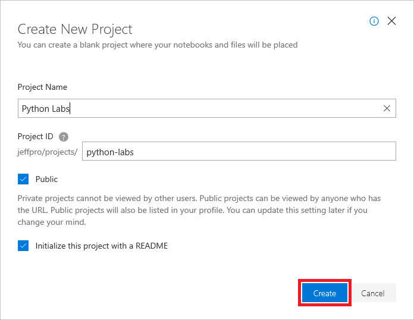
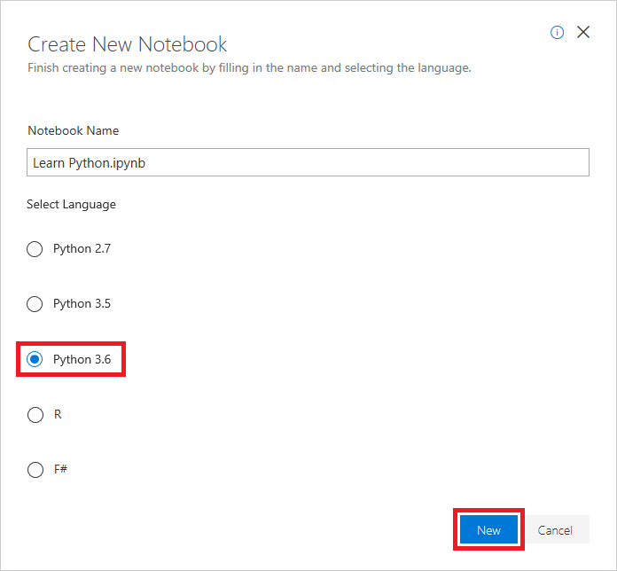
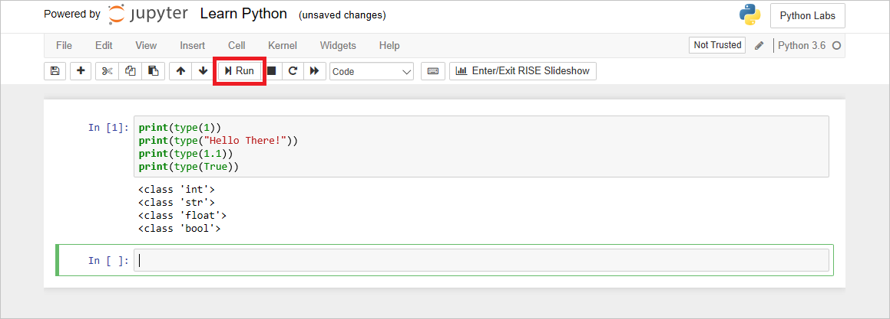
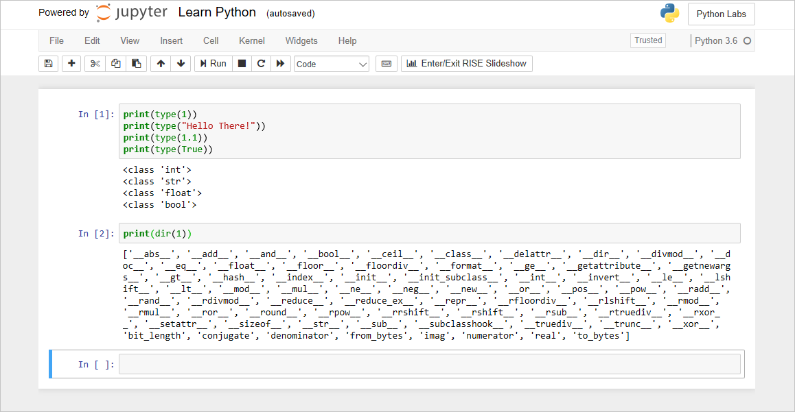

# Classes and objects in Python

The first step in writing object-oriented code is writing the classes from which objects will be created. In this unit, you will create a class in Python and then use the class to instantiate an object. The term "instantiate" is just a fancy way of saying that Python uses the class to create an object by allocating memory for the object and copying the object's code and data into memory. Just as you use a blueprint to create a house or a recipe to create a cookie, Python uses classes to create objects.

To run your Python code, you will use [Jupyter notebooks](https://jupyter.org/). Jupyter is an environment based on [IPython](https://ipython.org/) that facilitates interactive programming and data analysis using a variety of programming languages, including Python. Jupyter notebooks enjoy widespread use in research and academia for mathematical modeling, machine learning, statistical analysis, and for teaching and learning how to code.

## Create a notebook

[Azure Notebooks](https://blogs.msdn.microsoft.com/uk_faculty_connection/2017/06/10/guide-to-the-microsoft-azure-notebooks-for-students/) is a cloud-based platform for building and running [Jupyter notebooks](http://jupyter.org/). Azure Notebooks provide Jupyter as a service for free. It's a convenient way to build notebooks and to share them with others without having to install and manage a Jupyter server. And it's completely Web-based, making it an ideal solution for online collaboration.

Azure notebooks are created through the portal at https://notebooks.azure.com and require nothing more than a browser and a [Microsoft account](https://account.microsoft.com/account). Notebooks are contained in projects, whose purpose is to group related notebooks. Let's begin by creating a project and then creating a notebook inside it.

1. Navigate to https://notebooks.azure.com in your browser and sign in using your Microsoft account. Click **My Projects** in the menu at the top of the page. Then click the **+ New Project** button at the top of the "My Projects" page.

1. Create a new project named "Python Labs" or something similar.

	

	_Creating a project_

	Checking the "Public" box makes it easy to share notebooks later on. If you would prefer to keep the notebooks in this project private, make sure the box is unchecked. You can also go into project settings once a project is created and change its visibility to public or private.  

1. Click **+ New** and select **Notebook** from the menu to add a notebook to the project.

	

	_Adding a notebook to the project_

1. Give the notebook a name such as "Learn Python.ipynb," and select **Python 3.6** as the language. This will create a notebook with a Python 3.6 kernel for executing Python code. One of the strengths of Azure notebooks is that you can use different languages by choosing different kernels.

	

	_Creating a notebook_

	If you're curious, the .ipynb file-name extension stands for "IPython notebook." Jupyter notebooks were originally known as IPython (Interactive Python) notebooks, and they only supported Python as a programming language. The name Jupyter is a combination of Julia, Python, and R — the core programming languages that Jupyter supports.

1. Click the notebook to open it for editing.

You can create additional projects and notebooks as you work with Azure Notebooks. You can create notebooks from scratch, or you can upload existing notebooks. And once a notebook is created or uploaded, you can take advantage of Azure compute resources to run the notebook and leverage popular Python libraries such as [Pandas](https://pandas.pydata.org/) and [Scikit-learn](https://scikit-learn.org/stable/index.html).

## Objects in Python

Everything is an object in Python. When you create a variable and assign it a number, Python creates an instance of a built-in class. When you create a variable and assign it a string, Python once more creates an instance of a built-in class, albeit a different one. Before you begin writing classes of your own, it is helpful to peek under the hood and understand how Python itself uses objects.

1. To see how objects work in Python, return to the notebook you created a moment ago and type or paste the following code into the empty cell at the top of the notebook:

	```python
	print(type(1))
	print(type("Hello There!"))
	print(type(1.1))
	print(type(True))
	```

	The `print()` function writes output to the screen. The `type()` function shows an object's underlying class.

1. Make sure **Code** is selected in the drop-down list so the cell is a code cell, and then click the **Run** button to execute the code.

	
	
	_Identifying an object's class_

	The output shows that 1 is an instance of Python's built-in `int` class, while "Hello There!" is a `str` (string). Notice that Python uses different classes for 1 and 1.1; 1.1 is `float`, not an `int`. If something has a truth value, True or False, then it relies on the `bool` class.

	You could easily test other kinds of data (feel free to experiment!), but be assured that any sort of data you try has a associated class, whether one that is built into Python or one you have written yourself.

1. All classes have methods associated with them. Type the following code into the next cell and click **Run** to execute it:

	```python
	print(dir(1))
	```

	The `dir()` function provides a list of an object's methods. You sometimes hear methods referred to as *functions* when working with Python. The two terms are synonymous, but you can avoid confusion when talking with other people if you simply call them methods. 

	
	
	_Listing an object's methods_

	All the entries you see, such as `to_bytes`, are methods. A method represents an action that you can perform on an object. For example, `to_bytes()` outputs the object value in byte format, which is just a special way of looking at the data.

1. Notice the `__str__` method in the list. This method turns a value into a `str` (string) type. An object's type is simply the class it was created from. So the type of 1 is `int`.

	Run the following code in the notebook's next cell:

	```python
	myVar = 1
	print(type(myVar.__str__()))
	```

	The first line is an assignment. You're assigning the value 1 to an object named `myVar`. The `myVar` object now has an attribute: the value 1. The second line of code calls the `__str__()` method that is part of the `int` class and therefore present in the `myVar` object. What does the output from the code tell you?

The `__str__()` method created a new object from `myVar` of type `str`. The `myVar` object is still the same, completely untouched; it's still of type `int`. The new object – which doesn't have a name because you haven't assigned it one – is of type `str`.

## Define a class

Python has several built-in classes including `int`, `float`, `bool`, and `str`, but it also allows you to define classes of your own. This is the crux of object-oriented programming.

Every Python class you create begins with the word `class` (which makes sense). Of course, a class needs a name. A class also needs to do something. Let's begin with something simple: telling the user that the class has been created. In the real world, you wouldn't actually create a class like this, but it's helpful for learning in an incremental fashion.

1. Type the following code into an empty cell in the notebook:

	```python
	class myClass:
	    print('myClass created!')
	```

	This is the simplest class you can create. It contains the bare essentials needed to create a class:

	- The keyword `class`
	- The class name ("myClass")
	- A colon marking the end of the `class` statement

	Notice that the next line is indented. This is important! Python uses indentation to indicate structure. In this case, the `print()` statement is part of `myClass`.

1. Run the code and confirm that you see the following output:

	
	
The output proves that the class was created (not that it was instantiated). The `print()` function executes during the creation process. Normally, you wouldn't use a `print(`) statement this way, but here it helps to see how the class creation works.

## Instantiate a class

At this point, you have a very simple (and nearly useless) class, but it serves to show how classes are defined. Now let's created an object from the class.

1. Add the following statement to the notebook and run it:

	```python
	myVar = myClass()
	```

	This line creates an object named `myVar` from the class named `myClass`. Notice the parentheses after `myClass`. The parentheses tell Python to create an instance of the class without passing any parameters to it.

1. Run the following statements to prove that the object was created:

	```python
	print(type(myVar))
	print(dir(myVar))
	```

	The output shows that the type of `myVar` is `__main__.myClass`. `__main__` is the scope in which this code is executing. A scope is a kind of container that holds pieces of code together. You don't see a scope for the `int` type because `int` is defined outside the scope of the current application. You see `__main__` for `myClass` because you defined `myClass` within the current application. It's the default scope, but you don't need to worry about it for now. The important takeaway, for the moment, is that `myVar` is an instance of the `myClass` class.

Also notice that you get default methods with your new class. Python provides a class with these default methods to perform essential tasks. However, the methods aren't really functional now. It's simply a good idea to know that they exist. As you continue with this module, this information will become more relevant.